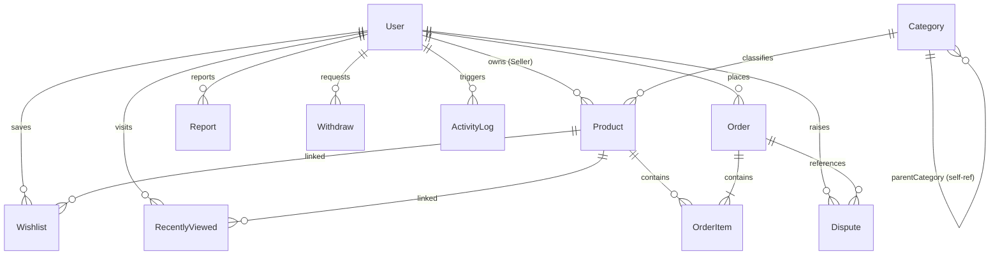

# OpenMarketly Backend Engine

OpenMarketly is a premium, multi-vendor e-commerce backend engine designed for high scalability, secure payments, granular auditing, and complex catalog hierarchies. Built with a modern **Node.js, Express, TypeScript, and MongoDB** architecture, it provides all the core services needed to run a multi-vendor marketplace platform.

---

## 📖 Table of Contents
1. [Core Features](#-core-features)
2. [Tech Stack & Architecture](#%EF%B8%8F-tech-stack--architecture)
3. [Database Schemas & Relationships Analysis](#-database-schemas--relationships-analysis)
4. [API Endpoints Directory](#-api-endpoints-directory)
5. [Key System Data Flows](#-key-system-data-flows)
6. [Auditing & Background Logging](#-auditing--background-logging)
7. [Directory Structure](#-directory-structure)
8. [Local Development Setup](#-local-development-setup)
9. [License](#-license)

---

## 🚀 Core Features

### 🔐 Multi-Tier Auth & Role-Based Access Control (RBAC)
*   **Four Distinct Roles:** Supports `SUPER_ADMIN`, `ADMIN`, `SELLER`, and `CUSTOMER`.
*   **Token Rotation:** Uses JWT Access and Refresh tokens for session handling.
*   **Verification Flow:** Secure onboarding with verification tokens and email-based One-Time Passwords (OTPs).
*   **Referral System:** Customers can invite users via referral codes. The system handles signup attribution securely without exposing financial parameters.

### 📦 Dynamic Catalog & Hierarchical Categories
*   **N-Level Nested Categories:** Implemented using a self-referencing `parentCategory` model. Product searches on parent categories recursively resolve and return items from all descendant subcategories.
*   **Smart Pricing & Variants:** Supports variables like color, size, and stock. Pre-save hooks automatically calculate sale prices based on original prices and discount percentages for both base products and variants.
*   **Auto SKU Generation:** Generates structural SKUs (e.g. `SKU-XXXXXX-COLOR-SIZE`) dynamically upon saving if not provided.
*   **Deals Tagging:** Optimized index lookups for `isFeatured`, `isTodayDeal`, and `isTrending` flags.

### 🛒 Cart, Wishlist, & Recently Viewed Services
*   **Carts:** Full cart manipulation API supporting guest checkout sync capabilities.
*   **Wishlists:** Clean toggling endpoints that resolve product wishlist status per authenticated user.
*   **Recently Viewed:** Silent background tracking of viewed products per user, capped at the 20 most recent entries with database cleanup optimization.

### 💸 Payments & Payouts (SSLCommerz & Seller Withdrawals)
*   **SSLCommerz Gateway:** Handles initial checkout, validation, redirect routing (success, cancel, fail), and IPN (Instant Payment Notification) transactions.
*   **Seller Balance Credit:** Internally manages wallets. Successfully completed checkouts automatically compute and credit seller balances.
*   **Withdrawal System:** Since SSLCommerz only acquires money from buyers (does not support payouts), seller withdrawals are processed via a request-review workflow. Sellers request cashouts via Bank or Mobile banking (bKash/Nagad/Rocket), holding the balance. Admins review, manually transfer funds, and approve or reject the request.
*   **Refund Integration:** Resolving refund disputes calls the SSLCommerz refund API to return payments to customer accounts automatically.

### ⚖️ Moderation & Auditing
*   **Dispute Claims:** Supports `REFUND`, `RETURN`, and `COMPLAINT` tickets raised by customers against orders.
*   **Report Tickets:** Customers can report suspicious products or users to keep the platform clean.
*   **Background Logging:** Tracks every mutation (Auth changes, catalog edits, settings revisions, withdrawals) in a secure, queryable audit trail database capturing the action, user, timestamp, client IP, and browser client.

---

## 🛠️ Tech Stack & Architecture

*   **Runtime:** Node.js (v18 or higher recommended)
*   **Backend Framework:** Express.js with TypeScript
*   **Database:** MongoDB via Mongoose
*   **Type Checker:** Strict-mode TypeScript compilation
*   **Payment Gateway:** SSLCommerz API
*   **Logging Engine:** Custom async audit services

OpenMarketly uses a **Layered Architecture** pattern:
```
[Client/Frontend] ──> [Routes] ──> [Middlewares] ──> [Controllers] ──> [Services] ──> [Models (Mongoose)]
```
This isolates the business logic (Services) from HTTP transport layers (Controllers), making testing and future scaling straightforward.

---

## 📊 Database Schemas & Relationships Analysis



### 1. User Schema (`User`)
*   **Purpose:** Houses credentials, roles, referral links, and internally-managed wallets.
*   **Fields:** `name`, `email`, `password`, `role`, `balance`, `referralCode`, `referredBy` (Self-ref User `ObjectId`), `isActive`, `isEmailVerified`.
*   **Indices:** Unique index on `email`, unique index on `referralCode`.

### 2. Product Schema (`Product`)
*   **Purpose:** Represents items listed by sellers. Supports variants and automated discount calculations.
*   **Fields:** `name`, `slug`, `sku`, `category` (`Category` `ObjectId`), `seller` (`User` `ObjectId`), `price`, `originalPrice`, `discountPercentage`, `isFeatured`, `isTodayDeal`, `isTrending`, `variants` (Subdocument Array of color/size/price/sku).
*   **Indices:** Compound text index on `name`, `description`, `brand`, and `tags` for search. Single indexes on `category`, `seller`, `price`, `isFeatured`, `isTodayDeal`, `isTrending`.

### 3. Category Schema (`Category`)
*   **Purpose:** Self-referential tree supporting hierarchical navigation.
*   **Fields:** `name`, `slug`, `parentCategory` (Self-ref Category `ObjectId`), `isActive`, `isDeleted`.
*   **Indices:** Unique slug, single index on `parentCategory`.

### 4. Order Schema (`Order`)
*   **Purpose:** Represents checkout items, payment statuses, and transaction details.
*   **Fields:** `user` (`User` `ObjectId`), `items` (Array of Product reference, quantity, price, color, size), `totalPrice`, `paymentStatus`, `orderStatus`, `transactionId`.
*   **Indices:** Unique index on `transactionId`.

### 5. Wishlist Schema (`Wishlist`)
*   **Purpose:** Maps products saved by customers.
*   **Indices:** Unique compound index `{ user: 1, product: 1 }` prevents redundant records.

### 6. Recently Viewed Schema (`RecentlyViewed`)
*   **Purpose:** Fast, rolling list of viewed products per authenticated session.
*   **Indices:** Unique compound index `{ user: 1, product: 1 }` for upserts, and index `{ user: 1, viewedAt: -1 }` for fast retrieval.

### 7. Withdraw Schema (`Withdraw`)
*   **Purpose:** Tracks seller payout requests and their bank or mobile financial details.
*   **Fields:**
    *   `seller`: `ObjectId` (Ref: `User`, Required)
    *   `amount`: `Number` (Required, Minimum: `100 BDT`)
    *   `paymentMethod`: `String` (Enum: `BANK`, `BKASH`, `NAGAD`, `ROCKET`)
    *   `paymentDetails`: `Object` (accountName, accountNumber, bankName, branchName, routingNumber)
    *   `status`: `String` (Enum: `PENDING`, `APPROVED`, `REJECTED`)
    *   `adminNote`: `String`
*   **Indices:** Index on `{ seller: 1, status: 1 }`, and `{ status: 1, createdAt: -1 }`.

### 8. Activity Log Schema (`ActivityLog`)
*   **Purpose:** Audit trail of critical administration, security, and checkout activities.
*   **Indices:** Index on `{ user: 1, createdAt: -1 }` and `{ action: 1, createdAt: -1 }`.

---

## 🔌 API Endpoints Directory

### 🔐 Authentication Module (`/api/v1/auth`)
| Method | Route | Access | Description |
| :--- | :--- | :--- | :--- |
| `POST` | `/register` | Public | Register new customer or seller account |
| `POST` | `/login` | Public | Login and retrieve tokens |
| `POST` | `/refresh-token` | Public | Obtain new access token via refresh token |
| `POST` | `/verify-email` | Public | Verify account using OTP / Token |
| `POST` | `/change-password`| Auth | Modify current account password |
| `PATCH`| `/update-profile` | Auth | Edit user details (role and balance protected) |

### 📦 Products Module (`/api/v1/products`)
| Method | Route | Access | Description |
| :--- | :--- | :--- | :--- |
| `GET` | `/` | Public | Fetch active products (with pagination, recursive subcategory logic, deals filters) |
| `GET` | `/:id` | Public | Get single product by ID (resolves `isWishlisted` if logged in) |
| `GET` | `/slug/:slug` | Public | Get single product by Slug (resolves `isWishlisted` if logged in) |
| `POST` | `/` | Seller/Admin| Create product and auto-generate SKUs |
| `PATCH`| `/:id` | Seller/Admin| Update product (seller verified ownership check) |
| `DELETE`| `/:id` | Seller/Admin| Soft delete product |

### 📂 Categories Module (`/api/v1/categories`)
| Method | Route | Access | Description |
| :--- | :--- | :--- | :--- |
| `GET` | `/` | Public | Retrieve category list |
| `GET` | `/parents` | Public | Retrieve root level categories |
| `GET` | `/subcategories/:parentId` | Public | Retrieve subcategories |
| `POST` | `/` | Admin | Create category |
| `PATCH`| `/:id` | Admin | Edit category |
| `DELETE`| `/:id` | Admin | Delete category |

### 🛒 Cart Module (`/api/v1/carts`)
| Method | Route | Access | Description |
| :--- | :--- | :--- | :--- |
| `GET` | `/` | Auth | Get active cart items |
| `POST` | `/add` | Auth | Add item to cart (validates inventory limits) |
| `PATCH`| `/update-quantity`| Auth | Update item quantities |
| `DELETE`| `/remove` | Auth | Remove item from cart |
| `DELETE`| `/clear` | Auth | Empty cart |

### ❤️ Wishlist Module (`/api/v1/wishlists`)
| Method | Route | Access | Description |
| :--- | :--- | :--- | :--- |
| `GET` | `/` | Auth | Retrieve user wishlist items |
| `POST` | `/toggle` | Auth | Toggle item in wishlist |
| `GET` | `/check/:productId` | Auth | Check if product is currently saved |

### 👁️ Recently Viewed Module (`/api/v1/recently-viewed`)
| Method | Route | Access | Description |
| :--- | :--- | :--- | :--- |
| `GET` | `/` | Auth | Fetch user history |
| `POST` | `/` | Auth | Save item (supports bulk array for guest syncs, fails silently) |
| `DELETE`| `/` | Auth | Clear view history |

### 💳 Checkout & Order Module (`/api/v1/orders`)
| Method | Route | Access | Description |
| :--- | :--- | :--- | :--- |
| `POST` | `/checkout` | Auth | Place order and get SSLCommerz payment gateway URL |
| `POST` | `/payment-success/:tranId` | Public | SSLCommerz Callback (sets paid status, credits sellers, adjusts inventory) |
| `POST` | `/payment-fail/:tranId` | Public | SSLCommerz Callback (marks failed order) |
| `POST` | `/payment-cancel/:tranId` | Public | SSLCommerz Callback (marks cancelled order) |
| `GET` | `/my` | Auth | Fetch customer order history |
| `GET` | `/:id` | Auth | Get details for specific order |

### 💸 Withdraw Module (`/api/v1/withdraws`)
| Method | Route | Access | Description |
| :--- | :--- | :--- | :--- |
| `POST` | `/` | Seller | Request a new withdrawal (holds balance) |
| `GET` | `/my` | Seller | Get history of own withdrawal requests |
| `GET` | `/` | Admin | List all withdrawal requests (supports `?status=PENDING` filter) |
| `PATCH`| `/:id/resolve`| Admin | Resolve request (sets status to `APPROVED` or `REJECTED`) |

### ⚖️ Disputes Module (`/api/v1/disputes`)
| Method | Route | Access | Description |
| :--- | :--- | :--- | :--- |
| `POST` | `/` | Auth | Open a dispute claim against a paid order |
| `PATCH`| `/:id/resolve`| Admin | Resolve dispute (triggers automated SSLCommerz refund) |
| `GET` | `/` | Admin | List all disputes |
| `GET` | `/my` | Auth | List own disputes |

### ⚙️ Site Settings Module (`/api/v1/settings`)
| Method | Route | Access | Description |
| :--- | :--- | :--- | :--- |
| `GET` | `/` | Public | Get branding, contact details, social links, and system flags |
| `PATCH`| `/` | Admin | Update system configurations |

---

## 🔄 Key System Data Flows

### 1. The SSLCommerz Checkout & Payment Flow
```
[Client] ──(Checkout Req)──> [Express Router]
                                    │
                            (validate stock & coupon)
                                    │
                                    ▼
                         [SSLCommerz API Init] ──(Get URL)──> [Return URL to Client]
                                                                        │
                                                                 (Redirect User)
                                                                        │
                                                                        ▼
                                                             [User Pays on Gateway]
                                                                        │
                                                                 (Redirect Callback)
                                                                        │
                                                                        ▼
                                                         [paymentSuccess controller]
                                                                        │
                                                            (Validate with SSLCommerz)
                                                                        │
                                                                        ▼
                                                           [Update Order status PAID]
                                                                        │
                                                               ┌────────┴────────┐
                                                               ▼                 ▼
                                                      [Deduct Inventory]  [Credit Seller Balance]
```

### 2. Seller Payout / Withdrawal Flow
```
[Seller requests payout] ──> [Verify balance >= requested amount]
                                           │
                                           ▼
                                 [Hold funds from wallet]
                                           │
                                           ▼
                                 [Create request PENDING]
                                           │
                                           ▼
                              [Admin reviews request details]
                                           │
                        ┌──────────────────┴──────────────────┐
                        ▼                                     ▼
                [Admin rejects request]               [Admin manually transfers bank cash]
                        │                                     │
                        ▼                                     ▼
            [Refund funds back to seller]             [Admin marks request APPROVED]
                        │                                     │
                        ▼                                     ▼
            [Set Request status REJECTED]             [Set Request status APPROVED]
```

---

## 📝 Auditing & Background Logging

All database alterations write audit records to the `ActivityLog` collection asynchronously.

### Logging Mechanism Example:
```typescript
// Inside auth.services.ts
activityServices.logActivity(
    user._id.toString(),
    ActivityType.LOGIN,
    "Logged in successfully"
);
```

### Monitored Actions:
*   **Auth Mutations:** `REGISTER`, `LOGIN`, `PASSWORD_CHANGE`, `PROFILE_UPDATE`
*   **Catalog Adjustments:** `PRODUCT_CREATE`, `PRODUCT_UPDATE`, `PRODUCT_DELETE`, `CATEGORY_CREATE`, `CATEGORY_UPDATE`, `CATEGORY_DELETE`
*   **Checkout Flow:** `ORDER_PLACE`, `PAYMENT_SUCCESS`, `PAYMENT_FAIL`
*   **System Admin Settings:** `SETTINGS_UPDATE`, `POLICY_UPDATE`

---

## 📁 Directory Structure

```
.
├── src/
│   ├── app.ts                  # Configures middlewares, handles routes, and sets CORS
│   ├── server.ts               # Connects database and spawns Node listener
│   ├── app/
│   │   ├── config/             # Config variables (env files loader)
│   │   ├── errors/             # Global error middleware & custom API Exception classes
│   │   ├── middlewares/        # Authentication, Role checks, request parsing
│   │   ├── routes/             # Main API Router
│   │   └── modules/            # Domain-driven features
│   │       ├── auth/           # Accounts & RBAC
│   │       ├── activity/       # Auditing & Logging
│   │       ├── banner/         # Ads and Slides
│   │       ├── cart/           # Shopping Cart logic
│   │       ├── category/       # Hierarchical categories
│   │       ├── coupon/         # Promo codes
│   │       ├── dispute/        # Disputes & refunds gateway
│   │       ├── product/        # Item definitions & inventory
│   │       ├── recentlyViewed/ # Silent user history sync
│   │       ├── report/         # Moderation tickets
│   │       ├── settings/       # E-Commerce configurations
│   │       ├── withdraw/       # Seller balance cashout requests
│   │       └── wishlist/       # Saved items list
│   └── utils/                  # Helper classes, email templates, database seeders
├── package.json
├── tsconfig.json
└── README.md
```

---

## ⚙️ Local Development Setup

### Prerequisites
*   Node.js (v18.x or v20.x recommended)
*   MongoDB (running locally or via MongoDB Atlas connection)

### Steps

1.  **Clone code and enter directory:**
    ```bash
    git clone <repository_url>
    cd OpenMarketly-Backend
    ```

2.  **Install dependencies:**
    ```bash
    npm install
    ```

3.  **Setup Environment Variables:**
    Create a `.env` file in the root directory and configure the variables:
    ```env
    PORT=5000
    DATABASE_URL=mongodb://localhost:27017/openmarketly
    BCRYPT_SALT_ROUNDS=12
    JWT_ACCESS_SECRET=your_super_secret_access_key
    JWT_ACCESS_EXPIRE=1d
    JWT_REFRESH_SECRET=your_super_secret_refresh_key
    JWT_REFRESH_EXPIRE=30d
    CLIENT_URL=http://localhost:3000
    
    # SSLCommerz Details
    STORE_ID=your_sslcommerz_store_id
    STORE_PASSWORD=your_sslcommerz_store_password
    IS_SANDBOX=true
    ```

4.  **Run in Development Mode:**
    Runs the dev environment with nodemon reloading:
    ```bash
    npm run dev
    ```

5.  **Compile TypeScript Code:**
    Compiles code to the production `/dist` output folder:
    ```bash
    npm run build
    ```

6.  **Verify Types:**
    Runs TypeScript type verification across the codebase:
    ```bash
    npx tsc --noEmit
    ```

---

## 📄 License

Distributed under the MIT License. See [LICENSE](file:///e:/apponislam/My%20Own/OpenMarketly/OpenMarketly-Backend/LICENSE) for more details.
